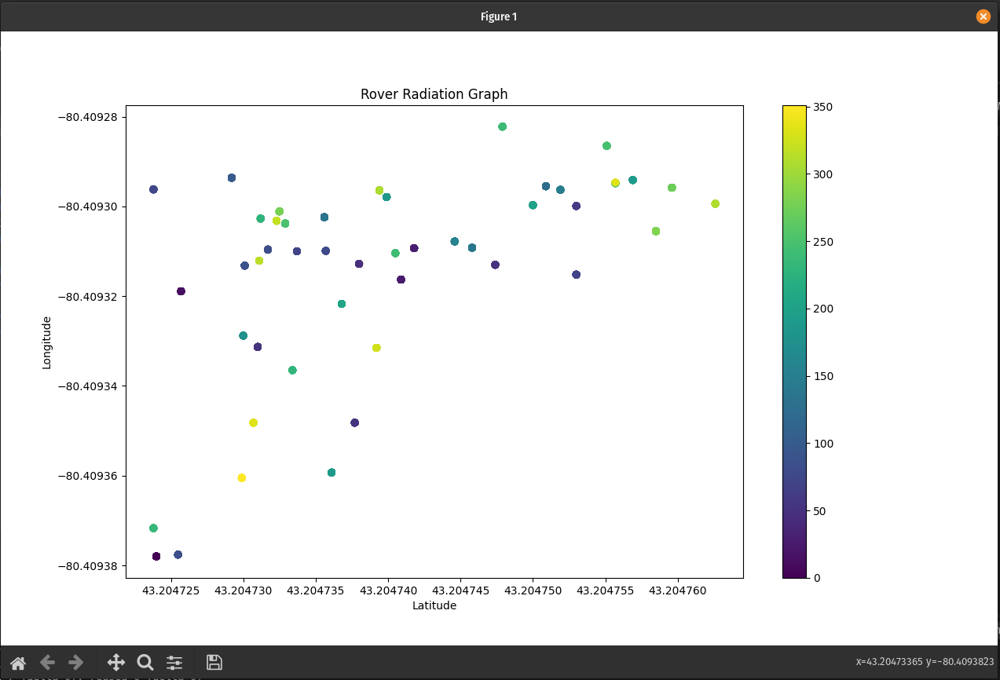

# Radiation Heat Map

> This is the code for the radiation heatmap for [Ryerson Rams Robotics](https://github.com/teamr3)' Mars Rover. 

Allows rover operators to better visualize radiation levels in the simulated martian landscape in the [Canadian International Rover Challenge](https://circ.cstag.ca/).

